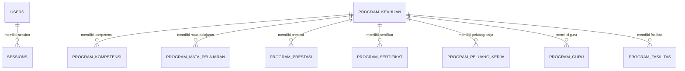

<p align="center">
  
  
  
  
  
</p>

# SMKIM4 — Website Profil SMK Istiqomah Muhammadiyah 4 Samarinda

Website profil dan informasi resmi **SMK Istiqomah Muhammadiyah 4 Samarinda**, dibangun dengan Laravel 13. Menampilkan profil sekolah, 6 program keahlian, berita, informasi SPMB, dan dilengkapi **panel admin** agar konten bisa dikelola mandiri tanpa mengubah kode.

Project dikembangkan sebagai bagian kegiatan PKL oleh **Hari Poppy Latip**.

---

## Daftar Isi

- [Fitur](#fitur)
- [Tech Stack](#tech-stack)
- [Akses Login Admin](#akses-login-admin)
- [Struktur Halaman (Route)](#struktur-halaman-route)
- [Struktur Folder](#struktur-folder)
- [Struktur Database](#struktur-database)
- [Cara Menjalankan di Lokal](#cara-menjalankan-di-lokal)
- [Seeder & Data Awal](#seeder--data-awal)
- [Catatan Penting](#catatan-penting)
- [Kredit](#kredit)

---

## Fitur

### Halaman Publik

| Halaman                                         | Isi                                                                                                            |
| ----------------------------------------------- | -------------------------------------------------------------------------------------------------------------- |
| **Beranda** (`/`)                               | Hero video background, sambutan kepala sekolah, keunggulan, fasilitas (accordion), berita terbaru (bento grid) |
| **Program Keahlian** (`/program-keahlian`)      | Daftar 6 jurusan dengan warna tema masing-masing                                                               |
| **Detail Jurusan** (`/program-keahlian/{slug}`) | Kompetensi, mata pelajaran, prestasi, sertifikat, guru, fasilitas, peluang kerja, hero gambar custom           |
| **Berita** (`/berita`)                          | Daftar berita, filter kategori, pagination, URL slug ramah SEO                                                 |
| **Detail Berita** (`/berita/{slug}`)            | Konten lengkap dengan editor TinyMCE                                                                           |
| **Profil Sekolah** (`/profile`)                 | Identitas, visi misi, sejarah (dinamis dari database)                                                          |
| **Kontak** (`/contact`)                         | Alamat, telepon, email, tautan sosial media                                                                    |
| **SPMB** (`/spmb`)                              | Informasi pendaftaran, alur, syarat, jadwal, kontak panitia (popup)                                            |
| **Tentang Pengembang** (`/tentang-pengembang`)  | Profil pengembang                                                                                              |
| **Sitemap XML** (`/sitemap.xml`)                | Untuk SEO mesin pencari                                                                                        |

### Panel Admin (`/admin`)

- Dashboard ringkasan data
- **CRUD Berita** dengan upload gambar + editor TinyMCE
- **CRUD Program Keahlian** + 7 sub-resources (kompetensi, mata pelajaran, prestasi, sertifikat, guru, fasilitas, peluang kerja) lengkap dengan upload gambar, logo, dan hero background
- **Pengaturan Home** (hero background, sambutan kepala sekolah)
- **Pengaturan SPMB** + kelola kontak panitia SPMB
- **Pengaturan Sosial Media** (YouTube, Instagram, Facebook, TikTok)
- **Pengaturan Profil Sekolah**
- **Fasilitas Umum** & **Unggulan**
- **Manajemen User & Role** (admin / editor)
- Profil akun & ubah password

---

## Tech Stack

- **Framework:** Laravel 13 (PHP `^8.3`)
- **Database:** MySQL 8 (lokal: Laragon / XAMPP)
- **Frontend publik:** Tailwind CSS 4 via CDN + konfigurasi inline, Google Fonts (Montserrat + Inter), Material Symbols Outlined
- **Frontend admin:** Tailwind CSS 4 + Vite (`app.css`, `dashboard.css`)
- **Editor konten:** TinyMCE 8
- **Lainnya:** Laravel Tinker, Laravel Pint, PHPUnit

---

## Akses Login Admin

| Item          | Nilai                                                    |
| ------------- | -------------------------------------------------------- |
| **URL login** | `/admin` (URL lama `/login` otomatis dialihkan)          |
| **Email**     | `admin@smkistiqomah.sch.id`                              |
| **Password**  | `admin123`                                               |
| **Role**      | `admin` (akses semua menu), `editor` (hanya CRUD berita) |

> **PENTING:** Ganti password default segera setelah deployment ke hosting.

Akun admin dibuat otomatis oleh seeder `AdminUserSeeder`.

---

## Struktur Halaman (Route)

Semua route publik + admin terdaftar di `routes/web.php`:

```text
GET  /                                 -> Beranda
GET  /program-keahlian                 -> Daftar jurusan
GET  /program-keahlian/{slug}          -> Detail jurusan
GET  /berita                           -> Daftar berita
GET  /berita/{slug}                    -> Detail berita
GET  /contact                          -> Kontak
GET  /profile                          -> Profil sekolah
GET  /spmb                             -> SPMB
GET  /tentang-pengembang               -> Tentang pengembang
GET  /sitemap.xml                      -> Sitemap SEO
GET  /dashboard                        -> Dashboard admin (auth + role:admin)

GET/POST  /admin                       -> Login admin
POST      /logout                      -> Logout

/admin/berita*                         -> CRUD berita (role: admin, editor)
/admin/users*                          -> Manajemen user (role: admin)
/admin/program-keahlian*               -> CRUD jurusan + sub-resources (role: admin)
/admin/pengaturan-home*                -> Pengaturan beranda (role: admin)
/admin/spmb*                           -> Pengaturan SPMB (role: admin)
/admin/kontak-spmb*                    -> Kontak SPMB (role: admin)
/admin/fasilitas-umum*                 -> Fasilitas umum (role: admin)
/admin/unggulan*                       -> Unggulan (role: admin)
/admin/profil-sekolah*                 -> Profil sekolah (role: admin)
/admin/sosial-media*                   -> Sosial media (role: admin)
/admin/profile*                        -> Profil akun sendiri (semua role)
```

Middleware kustom: `role` (`app/Http/Middleware/EnsureRole.php`) dengan pemakaian `role:admin,editor`.

---

## Struktur Folder

```text
app/
├── Http/
│   ├── Controllers/            # Controller publik (Home, Berita, Profile, ProgramKeahlian, Spmb, Contact, Sitemap)
│   │   ├── Admin/              # Controller panel admin
│   │   ├── Auth/               # LoginController
│   │   └── Dashboard/          # DashboardController
│   └── Middleware/             # EnsureRole (middleware role)
├── Models/                     # Eloquent models (20 tabel)
└── Providers/

config/                         # Konfigurasi Laravel
database/
├── migrations/                 # 33 file migration (20 tabel final)
└── seeders/                    # AdminUserSeeder, ProgramKeahlianSeeder, BeritaSeeder

public/
├── build/                      # Aset Vite hasil build
├── gambar/  tim/  videos/      # Aset statis (hero video: videos/hero-image.mp4)
└── storage/                    # Storage link (php artisan storage:link)

resources/
├── css/                        # app.css (Tailwind admin), dashboard.css (design system admin)
├── js/                         # Entry Vite
└── views/
    ├── layouts/                # public.blade.php (tema publik), app.blade.php (layout admin)
    ├── components/             # x-hero, cta-bergabung, media-card-image, navigation/
    ├── admin/                  # View panel admin (berita, users, program-keahlian, pengaturan, dll.)
    ├── dashboard/
    ├── auth/                   # Form login
    └── *.blade.php             # Halaman publik

routes/web.php                  # Semua route
```

---

## Struktur Database

**Total 20 tabel** dikelompokkan menjadi 6 kelompok:

| Kelompok         | Tabel                                                                                                                                                                                 |
| ---------------- | ------------------------------------------------------------------------------------------------------------------------------------------------------------------------------------- |
| Admin & Auth     | `users`, `password_reset_tokens`, `sessions`                                                                                                                                          |
| Program Keahlian | `program_keahlian` + 7 child (`program_kompetensi`, `program_mata_pelajaran`, `program_prestasi`, `program_sertifikat`, `program_peluang_kerja`, `program_guru`, `program_fasilitas`) |
| Berita           | `berita`                                                                                                                                                                              |
| Pengaturan       | `pengaturan_home`, `pengaturan_spmb`, `pengaturan_sosial_media`, `kontak_spmb`                                                                                                        |
| Profil & Landing | `profil_sekolahs`, `fasilitas_umums`, `unggulans`                                                                                                                                     |
| System           | `cache`, `jobs`                                                                                                                                                                       |

### Diagram Relasi (ERD)



Detail skema lengkap tersedia di `database-schema.txt` (versi detail per kolom).

### Catatan Skema

- Semua tabel child program keahlian memakai `cascadeOnDelete` (hapus jurusan otomatis menghapus child).
- `users.role` ditambahkan lewat migration `2026_08_01_000001_add_role_to_users_table.php` (default `admin`).
- Setiap tabel child punya kolom `urutan` untuk kontrol urutan tampil.
- Kolom warna jurusan (`warna`, `warna_bg`, `warna_icon`, `warna_container`, `warna_container_bg`) disimpan sebagai token warna yang dipetakan ke hex di halaman jurusan.

---

## Cara Menjalankan di Lokal

### Prasyarat

- PHP 8.3+ (development memakai PHP 8.5)
- MySQL 8 (atau komposer dengan mengubah `DB_CONNECTION=sqlite` di `.env`)
- Composer
- Node.js + npm

### Langkah

```bash
# 1. Install dependensi PHP
composer install

# 2. Siapkan environment
copy .env.example .env
php artisan key:generate

# 3. Konfigurasi database di .env (contoh MySQL)
# DB_CONNECTION=mysql
# DB_HOST=127.0.0.1
# DB_PORT=3306
# DB_DATABASE=smkim4
# DB_USERNAME=root
# DB_PASSWORD=

# 4. Buat database lalu migrasi + seed
php artisan migrate --seed

# 5. Storage link untuk file upload (foto, gambar, brosur)
php artisan storage:link

# 6. Build aset frontend
npm install
npm run build

# 7. Jalankan server
php artisan serve
```

Buka `http://127.0.0.1:8000` untuk website dan `http://127.0.0.1:8000/admin` untuk panel admin.

Untuk development dengan hot reload: `npm run dev` (Vite).

---

## Seeder & Data Awal

| Seeder                  | Isi                                                                                                                                                |
| ----------------------- | -------------------------------------------------------------------------------------------------------------------------------------------------- |
| `AdminUserSeeder`       | User admin (`admin@smkistiqomah.sch.id` / `admin123`)                                                                                              |
| `ProgramKeahlianSeeder` | 6 jurusan lengkap: **TKJT**, **DKV**, **TAB**, **TSM**, **TKR**, **LKS** beserta kompetensi, mapel, sertifikat, guru, fasilitas, dan peluang kerja |
| `BeritaSeeder`          | 6 berita contoh (kategori TKJT, DKV, General)                                                                                                      |

---

## Catatan Penting

1. **Design system** tersedia di `template/DESIGN.md`: tema Material Design 3 (primary `#001e40`, CTA kuning `#fcd400`, font Montserrat/Inter). Semua warna harus sinkron di 3 tempat: config Tailwind CDN di `layouts/public.blade.php`, `:root` di `resources/css/dashboard.css`, dan `$colorMap` halaman jurusan.
2. **Hero video** memakai `public/videos/hero-image.mp4` (muted). Jika video gagal load, fallback ke foto `hero_background_foto` lalu gradient navy.
3. **Komponen hero reusable** `<x-hero>` dipakai di home, profile, program-keahlian, spmb. Halaman detail jurusan tetap memakai gambar custom dari admin.
4. **Storage**: semua file upload disimpan di `storage/app/public/...` dan diakses via `public/storage` (wajib `php artisan storage:link`).
5. **Sitemap** `/sitemap.xml` di-generate dinamis dari database.
6. **Keamanan**: jangan commit `.env` (sudah ada di `.gitignore`). Ganti `APP_KEY`, password admin, dan kredensial DB saat produksi.
7. **Ubah warna baru**: pastikan selalu sinkron di 3 tempat (lihat poin 1), termasuk suffix opacity seperti `primary/20`.
8. **Editor berita** memakai TinyMCE 8 dengan upload gambar inline ke storage.

---

## Kredit

- Pengembang: **Hari Poppy Latip** (Haris)
- Sekolah: SMK Istiqomah Muhammadiyah 4 Samarinda
- Framework: [Laravel](https://laravel.com) (lisensi MIT)
